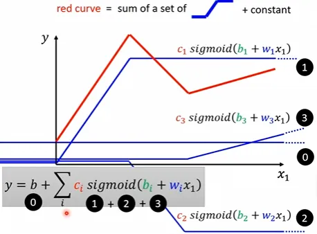

## 目标

实现一个Mini的Decoder-Only Transformer复习一下大致架构。

不会使用BPE，Rope，AdamW等等。理解网络结构，建立直觉为主。

只会将Pytorch视为一个“支持自动求导的矩阵库”来使用。

``` python
text = """hello world
hello transformer
transformer learns language
"""
```

训练文本就是这一段简单的英文。

希望训练完成后，当输入是`hello wo`时，该网络能输出下一个字符为`r`，然后能再自回归输出`l`，以此类推。

因为只是验证网络结构，当然“希望”它是过拟合的。

## 各模块

### Tokenizer

计算机显然看不懂文字，所以第一步是把训练文本转换成数字样本。

本网络以字母为Token基本单位来分词，所以按ASCII排个序的话`'\n'`会是0号Token，`' (空格)'`会是1号Token，`'a'`会是2号Token...

`hello`就变成`[7, 4, 8, 8, 11]`。

``` python title="基于字符的Tokenizer"
chars = sorted(list(set(text)))
vocab_size = len(chars)

stoi = {ch: i for i, ch in enumerate(chars)}
itos = {i: ch for i, ch in enumerate(chars)}

def encode(s: str) -> list[int]:
    return [stoi[ch] for ch in s]

def decode(l: list[int]) -> str:
    return ''.join([itos[i] for i in l])

data = torch.tensor(encode(text), dtype=torch.long) # 把训练文本变成数字样本
print(data.shape) # torch.Size([58]) 此时训练数据就变成58个Token
```

虽然简单，但是缺点很明显，一是字母本身没什么含义，后续的`embedding`矩阵就没这么好训。

二是转换过后的序列会很长，训推效率就慢了。

而且如果输入里碰到训练文本里没有的字符，这里`encode`直接就报错了。

真实场景会用BPE，SentencePiece之类的分词器。

### 理解Training Parallelism

假设`data = [1, 2, 3, 4, 5]`。

假设取训练输入为前三个`[1, 2, 3]`，预测出下一个位置的Token，假设是`2`，然后和真实标签`4`比对，算损失函数，算梯度，反向传播。

这样一次forward其实只训练了一次，其实可以利用输入里的信息，再配合掩码矩阵，同时训练：

``` txt
1       → 2
1 2     → 3
1 2 3   → 4
```

所以对于输入`x = [1, 2, 3]`，应该准备的标签不是`y = 4`，而是`y = [2, 3, 4]`。

同时，真正训练的时候不会只拿一组输入和标签，会拿一个Batch，这和普通机器学习是一致的。

``` python title="构造一个Batch的输入和标签"
batch_size = 4
block_size = 8

def get_batch():
    ix = torch.randint(0, len(data) - block_size, (batch_size,))
    x = torch.stack([data[i:i+block_size] for i in ix])
    y = torch.stack([data[i+1:i+block_size+1] for i in ix])
    return x, y

x, y = get_batch()
print(x.shape, y.shape) # torch.Size([4, 8]) torch.Size([4, 8])
```

此时输入数据的形状变成`[B, T]`形式，`B`指一个Batch有几组，`T`指训练时Transformer最远能看到的序列长度（这就是上下文长度）。

### Token Embedding + Position Embedding

现在的Token还不能直接进Attention层。

``` txt
h → token 7
e → token 4
l → token 8
```

此时这些数字都完全没有语言学意义，需要**给每一个Token分配一个可以从训练中学习的向量**，让这个向量有语言学意义。

这些向量放在一起，就构成Token Embedding矩阵，形状是`[V(vocab_size), C(n_embd)]`，第一维对应每一个Token，第二维对应Embedding向量，这一维越大能蕴含的语言学意义就会更丰富。

``` python
n_embd = 32

token_embedding_table = torch.randn(vocab_size, n_embd) * 0.02 # GPT说 * 0.02 是一种很常见的参数初始化方式
token_embedding_table.requires_grad_(True) # 告诉Pytorch这是一个需要训练的参数，方便自动求导

tok_emb = token_embedding_table[x] # Pytorch的高级索引
print(tok_emb.shape) # torch.Size([4, 8, 32])
```

现在输入形状变成`[B, T, C]`。一个Batch里有四组训练数据，每组训练数据有八个Token，每个Token对应一个32维的Embedding向量。

语言学意义除了和单词本身有关，还和单词所在的位置有关。

``` txt
dog bites man.
man bites dog.
```

所以还需要加上位置的信息，思想和Token Embedding基本是一样的。

**给每一个Token分配一个可以从训练中学习的向量** --> **给每一个位置分配一个可以从训练中学习的向量**。

``` python
position_embedding_table = torch.randn(block_size, n_embd) * 0.02
position_embedding_table.requires_grad_(True)

positions = torch.arange(block_size) # 这个API等于初始化成0, 1, 2, 3...

pos_emb = position_embedding_table[positions]
print(pos_emb.shape) # torch.Size([8, 32])

x = tok_emb + pos_emb # [B, T, C] + [T, C] Pytorch在这里Broadcast
print(x.shape) # torch.Size([4, 8, 32])
```

现实里位置编码没这么简单会上RoPE之类的。

### Single-Head Causal Self-Attention

现在的输入形状是`[B, T, C]`，每一个Token事实上都已经变成C维的向量。

现在希望进一步让往这个向量里混入上下文的信息。比如`it`这个词显然很需要上下文。

``` txt
The cat ate the fish because it was hungry
```

Attention模块实现这一点的方法是通过三个可学习矩阵$W_q, W_k, W_v$把每个Token分成Q，K，V向量。

Q，K，V可以大概理解成：

``` txt
Query：
“我现在在找什么信息？”

Key：
“我这里是什么信息？”

Value：
“如果你决定关注我，我真正把什么信息给你？”
```

`Query(it)`可能在问“我指代谁？”。

`Key(cat)`，`Key(fish)`可能表示“我作为一个实体，和查询有多匹配？”。

`Q(it) · K(cat)`，`Q(it) · K(fish)`算向量点积（几何意义反映了方向一致程度），决定`it`应该取回什么信息。

最终真正取回的是`V(cat), V(fish)`。

实际上也不需要`for 每一个token: 分别去乘Wq, Wk, Wv`得到Q，K，V。

这就是一个矩阵乘法。

``` python 
head_size = 32 # 单头注意力一般 H 就设成 C

Wq = torch.randn(n_embd, head_size) * 0.02
Wq.requires_grad_(True)
Wk = torch.randn(n_embd, head_size) * 0.02
Wk.requires_grad_(True)
Wv = torch.randn(n_embd, head_size) * 0.02
Wv.requires_grad_(True)

q = x @ Wq # [B, T, C] @ [C, H] = [B, T, H]，Pytorch会处理 B 这一维
k = x @ Wk
v = x @ Wv
```

算完每一个Token的Q，K，V向量以后，继续要做的是，对于每一个Token，计算它的Q和所有Token的K的点积，来做相关性打分。

这件事也是矩阵乘法。但由于形状需要转置一下K。

然后就能得到注意力分数矩阵$S = QK^T$。

`S[i, j]`就代表了`第 i 个 query 与第 j 个 key 的相关性`。

``` python
scores = q @ k.transpose(-2, -1) # [B, T, H] @ [B, H, T] = [B, T, T]

scores = scores / (head_size ** 0.5)

mask = torch.tril(torch.ones(block_size, block_size)) # 主对角线 + 下三角全 1 矩阵

for b in range(batch_size):
    scores[b][mask == 0] = float('-inf')

scores = scores - scores.max(dim=-1, keepdim=True).values # softmax(x) = softmax(x - c) 防止溢出 
exp_scores = torch.exp(scores)
weights = exp_scores / exp_scores.sum(
    dim = -1,
    keepdim = True
)

out = weights @ v # [B, T, T] @ [B, T, H] = [B, T, H]
```

论文里的最终的公式是这样的：

$Attention(Q,K,V)=softmax\left(\frac{QK^T}{\sqrt{d_k}}\right)V$

注意到注意力分数矩阵还需要除一个奇怪的东西，下面解释为什么要除以这个东西。

$q \cdot k = q_1k_1 + q_2k_2 + ... + q_{32}k_{32}$，这是注意力分数计算的公式。

如果假设q和k的每个维度都是均值为0、方差为1的独立随机变量（这是初始化时的大致情况），那么点积的方差会累积：

$Var(s_{i, j}) = \sum_{r=1}^{H}{Var(q_{ir})\cdot Var(k_{jr})} = H$

所以H越大，点积数值范围就会大。$H=64$的时候，点积波动可能就是±8。这会导致后续`sofmax`那个函数很难训。

我们希望方差是1。

所以$Var(\frac{s_{i, j}}{\sqrt{H}}) = \frac{Var(s_{i, j})}{H} = 1$。

论文里那个$d_k$在这里的含义就是$H$。

至于为什么要进一步用`softmax`而不直接用相关性矩阵，没有从GPT获得满意的答案，总之也是更好训。

还有一个问题是目前的注意力矩阵每个位置都可以互相看。

如果训练的时候`h`的`Q`直接看到`e`的`K`，注意到`e`的V，那就相当于作弊了，所以需要一个掩码矩阵。

把看不见的地方置成`-inf`，进到`softmax`以后就自然变成概率趋近于零。

最后一步`weights @ V`就很自然地能理解成根据注意力分数表，把别人的Value信息取回来并加权汇总。

所以Self-Attention这一层可以理解为**每一个 Token 都根据当前内容，从之前 Token 的 Value 中重新混合出一个新的表示**。
 
### Multi-Head Causal Attention

Transformer一般会用多头的注意力。

从直觉上，多头注意力可以理解成让模型同时从多个不同的“表示子空间”里观察 Token 之间的关系。

比如某个头训练完成后可能更关注指代关系，某个头更关注邻近Token。

但是代码上不会像创建`Wq_h0`，`Wq_h1`，`Wq_h2`，`Wq_h3`四个矩阵这样写，还是会先当一个矩阵算，然后把最后一维拆成四组。

代码上和单头注意力高度相似。

把多个头拼到一起，以作为下一层的输入之前，还得多学一个矩阵`Wo`，可以直觉理解为多个头各自拿回来一部分信息，拼起来后，再让模型学习如何把这些头的结果重新混合。

``` python
n_head = 4
head_size = n_embd // n_head # 32 // 4 = 8

Wq = torch.randn(n_embd, n_embd) * 0.02
Wq.requires_grad_(True)
Wk = torch.randn(n_embd, n_embd) * 0.02
Wk.requires_grad_(True)
Wv = torch.randn(n_embd, n_embd) * 0.02
Wv.requires_grad_(True)
Wo = torch.randn(n_embd, n_embd) * 0.02
Wo.requires_grad_(True)

q = x @ Wq 
k = x @ Wk
v = x @ Wv

B, T, C = x.shape
q = q.reshape(B, T, n_head, head_size) # [B, T, n_head, head_size]
k = k.reshape(B, T, n_head, head_size)
v = v.reshape(B, T, n_head, head_size)

q = q.transpose(1, 2) # 单纯为了后续计算，这里要换维
k = k.transpose(1, 2) # [B, n_head, T, head_size]
v = v.transpose(1, 2)

scores = q @ k.transpose(-2, -1) # [B, n_head, T, T]
scores = scores / (head_size ** 0.5)

mask = torch.tril(torch.ones(T, T))

scores = scores.masked_fill(mask == 0, float('-inf')) # Pytorch API

scores = scores - scores.max(dim=-1, keepdim=True).values

exp_scores = torch.exp(scores)

weights = exp_scores / exp_scores.sum(
    dim=-1,
    keepdim=True
)

out = weights @ v # [B, n_head, T, head_size]

out = out.transpose(1, 2) # [B, T, n_head, head_size]
out = out.reshape(B, T, C) # [B, T, C] 把四个头拼回来

out = out @ Wo 
```

### Residual + Layer Norm

现代Decoder-Only Transformer通常不是：

``` python
x = attention(x)
```

这样让一个序列经过注意力层，而是：

``` python
x = x + attention(layer_norm(x))
```

Residual的直觉理解是，不希望Token的原意在经过多层神经网络后被稀释，忘记自己原本是谁。总之是一个很有效的Trick。

至于Layer Norm的作用，是把每个Token自己的特征向量规范到一个比较稳定的尺度，再送进下一个复杂模块。

``` txt title="每个Token向量的数值范围"
第1层：
0.1 ~ 1

第5层：
-4 ~ 7

第20层：
-100 ~ 200
```

不同层、不同Token的数值尺度越来越不可控，会让训练变困难。

假设一个Token向量为：

$x = [x_1, x_2, x_3, ..., x_c]$

先算平均数：

$\mu=\frac{1}{C}\sum_i x_i$

再算方差：

$\sigma^2=\frac{1}{C}\sum_i(x_i-\mu)^2$

标准化：

$\hat{x}_i=\frac{x_i-\mu}{\sqrt{\sigma^2+\epsilon}}$

这套过程把一组数据变换成均值为 0、方差为 1 的分布。

$\epsilon$的作用是方差为0的时候除零错误。

$y_i=\gamma_i\hat{x}_i+\beta_i$

最后Layer Norm还有两个可学习参数。

直觉上理解，是让数据稳定的同时，让模型拥有重新把数据恢复到对当前任务最有利的形态。

``` python
ln1_gamma = torch.ones(n_embd)
ln1_gamma.requires_grad_(True)
ln1_beta = torch.zeros(n_embd)
ln1_beta.requires_grad_(True)

def layer_norm(x, gamma, beta):
    mean = x.mean(dim=-1, keepdim=True)
    var = ((x - mean) ** 2).mean(dim=-1, keepdim=True)
    x_hat = (x - mean) / torch.sqrt(var + 1e-5)
    return gamma * x_hat + beta

residual = x
xn = layer_norm(x, ln1_gamma, ln1_beta)
attn_out = multi_head_attention(xn)
x = residual + attn_out
```

到这里就实现完了一个Transformer Block的上半部分。

``` txt
x
│
├───────────────┐
│               │
↓               │
LayerNorm       │ Residual
↓               │
Attention       │
↓               │
+ ←─────────────┘
↓
new x
```

### MLP

Attention层只让Token吸取了需要的上下文信息。

但还没有解决如何在自己的特征维度内部进一步加工这些信息。

直觉例子过完Attention层，`it`这个Token已经拿到了如下信息(虽然我的丐版GPT会把`it`当成两个Token)：

``` txt
“当前词是 it”
+
“前面出现了 cat”
+
“前面出现了 hungry”
```

MLP负责把`cat + hungry + it`加工成更高级的信息。

这一层的公式是$f(x)=W_2 \sigma(W_1x+b_1)+b_2$

经典Transformer里的实现会先扩大维度再经过非线性激活，以提供更强的表示能力。

``` python
hidden_size = 4 * n_embd

W1 = torch.randn(n_embd, hidden_size) * 0.02 # [C, 4C]
W1.requires_grad_(True)
b1 = torch.zeros(hidden_size) # [4C]
b1.requires_grad_(True)

W2 = torch.randn(hidden_size, n_embd) * 0.02 #[4C, C]
W2.requires_grad_(True)
b2 = torch.zeros(n_embd) #[C]
b2.requires_grad_(True)

ln2_gamma = torch.ones(n_embd)
ln2_beta = torch.zeros(n_embd)

ln2_gamma.requires_grad_(True)
ln2_beta.requires_grad_(True)

def mlp(x):
    h = x @ W1 + b1 # [B, T, 4C]
    h = h * (h > 0)  # ReLU activation
    out = h @ W2 + b2
    return out

residual = x
xn = layer_norm(x, ln2_gamma, ln2_beta)
mlp_out = mlp(xn)
x = residual + mlp_out
```

丐版GPT用了RELU，正版GPT用的是GELU之类的。

然后MLP也同样需要LayerNorm和Residual。

``` txt
              x
              │
      ┌───────┴─────────┐
      │                 │
      │            LayerNorm
      │                 │
      │            Multi-Head
      │         Causal Attention
      │                 │
      └─────── + ◄──────┘
               │
               x
               │
       ┌───────┴─────────┐
       │                 │
       │             LayerNorm
       │                 │
       │                MLP
       │                 │
       └─────── + ◄──────┘
                │
                x
```

这就是一个Transformer Block的全貌了。

#### 为什么MLP可以加工出高维信息？

距离第一次看李宏毅的机器学习课有点久远了，对这里稍微有点遗忘。顺便复习一下。

第一个是特征激活视角。

把 $\sigma(W_1x+b_1)$ 看作针对一个高维特征的检测器。

$W_1x+b_1$ 计算输入`x`在某个方向上的投影。

$\sigma$ 把这个投影转换成激活强度（比如 ReLU 会保留正值，丢弃负值）。

然后再把这些激活强度按线性组合起来。

第二个是函数拟合视角。

 

线性函数只能刻画一条线，刻画不出红色折线，更刻画不出曲线。

但是红色折线可以由若干个Hard Sigmoid叠加得到。

可以近似Hard Sigmoid的函数有很多，比如Sigmoid，RELU等。

进一步发现只要有无限个Sigmoid，并通过改变`c, w, b`平移缩放，就能刻画任意非线性函数。

Transformer的MLP有Hidden size个激活函数。

### Block

先讲直觉上为什么要堆叠多层Block。

``` txt
The animal didn't cross the street because it was too tired.
```

对这样一句话，模型理解可能需要：

``` txt
底层：
局部字符/词关系
↓
中间：
短语、语法结构
↓
更深层：
it 与 animal 的关系
↓
更深层：
整个句子的语义表示
```

每经过一个Block，所有Token都有机会再进行一次“上下文通信 + 自身计算”，不断地Refine Hidden Representation。

所以假如有三层，就要训三套不同参数。

``` txt
Block 0
    Wq0 Wk0 Wv0 Wo0
    LN1_0
    W1_0 W2_0
    LN2_0

Block 1
    Wq1 Wk1 Wv1 Wo1
    LN1_1
    W1_1 W2_1
    LN2_1

Block 2
    Wq2 Wk2 Wv2 Wo2
    LN1_2
    W1_2 W2_2
    LN2_2
```

所以为了方便，就可以把之前的代码按面向对象的方法组装一下。

``` txt
Block
├── Attention
│   ├── Wq
│   ├── Wk
│   ├── Wv
│   └── Wo
│
├── MLP
│   ├── W1
│   ├── b1
│   ├── W2
│   └── b2
│
├── LN1 gamma
├── LN1 beta
├── LN2 gamma
└── LN2 beta
```

到这里已经可以数一下参数了：

``` python
params = [
    token_embedding_table,
    position_embedding_table,
    ln_f_gamma,
    ln_f_beta,
    W_lm,
    b_lm
]
for block in blocks:
    params += block.parameters()

num_params = sum(p.numel() for p in params) # Pytorch API number of elements
print("Number of parameters:", num_params) # 39153
```

网上看到的多少多少B模型，就是这里的数字，丐版GPT只有这么点参数。

### Final Layer Norm

在把经过多层Block的Hidden Representation映射到词表之前还需要一层Layer Norm稳定一下数据尺度，这点比较好理解。

### LM Head + Cross Entropy

现在我们手里有：

``` txt
4 个样本
每个 8 个位置
每个位置一个 32 维 hidden state
```

但实际的问题是：下一个Token是什么？

所以需要：

``` txt
32维 hidden state
↓
vocab_size维 vocabulary scores
```

实际上就是一个简单的线性变换。

``` python
W_lm = torch.randn(n_embd, vocab_size) * 0.02
b_lm = torch.zeros(vocab_size)

W_lm.requires_grad_(True)
b_lm.requires_grad_(True)

logits = x @ W_lm + b_lm # [B, T, C] @ [C, vocab_size] + [vocab_size] = [B, T, vocab_size]
```

现在有：

``` txt
logits [B, T, vocab_size]

真实标签targets = y [B, T]

logits[0, 3]代表第零个样本第三个位置对下一个位置的打分表
y[0, 3]代表这个位置真的应该出现的词的Token id
```

Cross Entropy 做的事情非常简单：看模型给正确 token 分配了多大的概率。

假设正确答案是`c`。

现在词表打分是：

``` txt 
a  0.1
b  0.2
c  0.6
d  0.1
```

那`loss = -log(0.6)`。

如果`c`的概率很小，比如`-log(0.001)`，那`loss`就会很大。

``` python
shifted = logits - logits.max(dim=-1, keepdim=True).values
exp_logits = torch.exp(shifted)
probs = exp_logits / exp_logits.sum(
    dim=-1,
    keepdim=True
) # [B, T, vocab_size] / [B, T, 1] = [B, T, vocab_size]

correct_probs = []
B, T = y.shape
for b in range(B):
    for t in range(T):
        target_id = y[b, t]
        correct_probs.append(probs[b, t, target_id])
correct_probs = torch.stack(correct_probs) # [B*T]

loss = -torch.log(correct_probs).mean()
```

`loss`实践里也一般取一个Batch的平均损失。

### Train

``` python
def forward(idx, targets=None): # 推理也能复用这个函数，所以targets可以是None
    B, T = idx.shape

    tok_emb = token_embedding_table[idx]
    positions = torch.arange(T)
    pos_emb = position_embedding_table[positions]

    x = tok_emb + pos_emb

    for block in blocks:
        x = block.forward(x)

    x = layer_norm(x, ln_f_gamma, ln_f_beta)

    logits = x @ W_lm + b_lm

    if targets is None:
        loss = None
    else:
        shifted_logits = logits - logits.max(dim=-1, keepdim=True).values
        exp_logits = torch.exp(shifted_logits)
        probs = exp_logits / exp_logits.sum(dim=-1, keepdim=True)

        correct_probs = []
        for b in range(B):
            for t in range(T):
                target_id = targets[b, t]
                correct_probs.append(probs[b, t, target_id])
        correct_probs = torch.stack(correct_probs)

        loss = -torch.log(correct_probs).mean()

    return logits, loss

learning_rate = 1e-1

for step in range(10000):
    for p in params:
        if p.grad is not None:
            p.grad.zero_() # Pytorch默认累积旧梯度

    x, y = get_batch()
    logits, loss = forward(x, y)

    loss.backward()

    for p in params:
        p.data -= learning_rate * p.grad

    if step % 1000 == 0:
        print(f"Step {step}, Loss: {loss.item()}")
```

最简单的梯度下降，固定学习率乘以梯度，实践中会用AdamW之类的优化器。

``` txt
Number of parameters: 39153
Step 0, Loss: 2.857172966003418
Step 1000, Loss: 0.2829711437225342
Step 2000, Loss: 0.13453564047813416
Step 3000, Loss: 0.22403913736343384
Step 4000, Loss: 0.13751254975795746
Step 5000, Loss: 0.24869270622730255
Step 6000, Loss: 0.21029910445213318
Step 7000, Loss: 0.2140178233385086
Step 8000, Loss: 0.17408768832683563
Step 9000, Loss: 0.09230954200029373
```

能收敛，说明网络结构没写错。

### Autoregressive Decoding

现在试着真的让网络生成Token，朴素地自回归。

因为我们的`position_embedding_table`是写死了只有八个位置。

如果不限制模型看的到的长度，就会Crash。

换成RoPE可以解决这件事，但上下文只要长了推理质量都会下去。

``` python
def generate(idx, max_new_tokens):
    for _ in range(max_new_tokens):
        idx_cond = idx[:, -block_size:] # 逗号是Pytorch分维度写法，表示取所有行，最后block_size列
        logits, _ = forward(idx_cond) # [B, T, C]
        logits = logits[:, -1, :]
        probs = torch.softmax(logits, dim=-1)
        next_id = torch.argmax( 
            probs,
            dim=-1,
            keepdim=True
        )
        idx = torch.cat((idx, next_id), dim=1) # Pytorch API, dim=1表示按列拼接
    return idx # [B, T+max_new_tokens]

idx = torch.tensor([[stoi['h']]], dtype=torch.long) # 为了复用函数，加上Batch那一维
output_idx = generate(idx, max_new_tokens=20)
output_text = decode(output_idx[0].tolist())
print("Generated text:", output_text)
```

确实生成对了。

``` txt
Generated text: hello world
hello tra
```

## 总结

总结一下各个模块的作用。

``` txt
Tokenizer
“文字 → token”

Embedding
“每个 token 先有自己的表示”

Position
“告诉它自己在哪”

Attention
“看看之前有哪些 token 对我有用，把它们的信息拿过来”

Residual
“别把我原来的信息弄丢”

MLP
“拿到这些信息后，在我自己的特征维度里再加工一次”

Block × N
“重复：交流 → 加工 → 交流 → 加工”

LM Head
“把最终表示翻译成：下一个 token 最可能是谁” 
```

然后到了推理：

``` txt
已有 token
→ Transformer
→ 下一个 token
→ append
→ Transformer
→ 下一个 token
→ append
→ ...
```