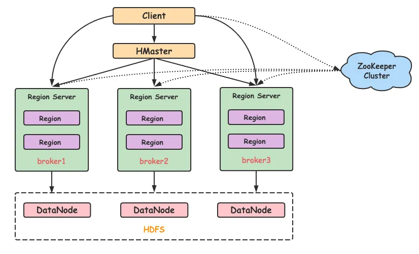
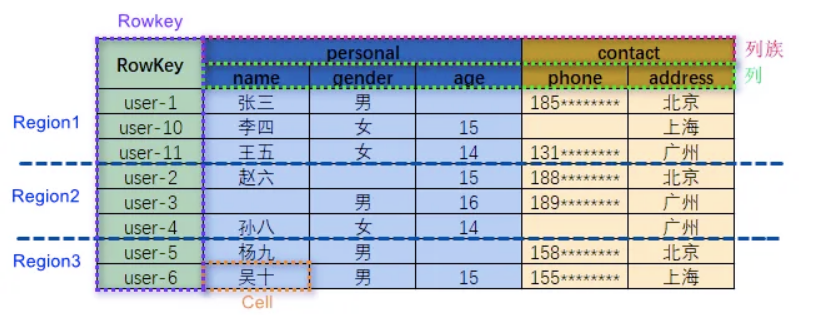

实习业务部分和这套相关，有必要研究一下读写特性。

## HBase

HBase的设计是面向这样的场景：PB级数据、追求对单行数据或小范围数据的**毫秒级**访问。是TP系统。



HBase 的数据模型是一张巨大的、排序的、稀疏的映射表（Sorted Map），行键（RowKey）按字典序排序。为了分布式存储，表会被自动切分成很多个 Region。

- Region：就是一片连续的行键范围，是 HBase 中分布式和负载均衡的最小单元。

- 每个 Region 会交给一个 RegionServer 管理。一个 RegionServer 可以管理很多个 Region。

- RegionServer 就是真正的工人，负责处理它管辖的 Region 上的所有读写请求。

``` txt
Region (行键范围)
                 |
        +--------+--------+
        |                 |
     Store A            Store B    (对应列族)
        |                 |
  +-----+-----+     +-----+-----+
  |           |     |           |
MemStore   HFile   MemStore   HFile ...
(内存)     (磁盘)   (内存)     (磁盘)
```

每个工人（RegionServer）管理抽屉（Region）时，内部又有精细分工。一个 Region 包含多个 Store，每个 Store 对应一个列族。

每个 Store 内部有：

- MemStore（内存缓存）：一个有序的内存区域，所有写入操作先写一份到 HLog（预写日志），然后再写这里，返回成功。这是 HBase 写速度极快的原因——顺序写WAL+内存写入。

- HFile（磁盘文件）：当 MemStore 大到一定程度，整个刷写到 HDFS 上变成一个不可变的 HFile。读数据时，需要合并 MemStore 和多个 HFile 中的结果。

- HLog（Write\-Ahead Log）：存于 HDFS，是安全的保障。在数据刷到 HFile 前，若机器宕机，可以从 HLog 重放恢复数据。

HFile对应LSM\-Tree里的SSTable，Memstore显然就是Memtable。HBase里每一个Store对应一棵LSM\-Tree。

LSM\-Tree的K是\(rowkey, family, qualifier, timestamp, type\)，V是cell value。

type指的是put/delete。

上面的HDFS只是一个例子，其实S3之类的都可以，但文件格式都是HFile。

**写入流程：**

1. Client 问 ZooKeeper：“我要写表 T，行键 R 的元数据存在哪？” ZooKeeper 告诉他去找哪个 RegionServer（存有 `hbase:meta` 表的 RegionServer）。

2. Client 从 `meta` 表查到，目标行键 R 属于哪个 Region，由哪个 RegionServer 管理。这个位置信息会缓存起来。

3. Client 直接联系那个 RegionServer，发出写请求。

4. RegionServer 先将写入记录到 HLog，然后写入对应 Region 的 MemStore。一旦两者都完成，就返回写入成功。

**读取流程：**

1. 同样的元数据定位，Client 直接找到目标 RegionServer。

2. RegionServer 要在该行所在的 Region 里，合并 MemStore 和所有相关的 HFile 数据，按时间戳或版本取出最新的，返回给 Client。

3. 读操作是强一致的：一定能读到之前已写入的数据。

HMaster不参与读写，只管负载均衡、故障转移等。



整张表是按RowKey的字典序排序的。

每个表一开始只有一个Region，随着不断增大会分裂。

## ElasticSearch

从HBase的结构能看出HBase肯定很擅长下面的场景：

- 点查。

- 小范围顺序查：如果落在少数几个Region里。

- 高吞吐随机写：不同Store是不同的LSM\-Tree，可以并发写。

- 支持单行事务：一行肯定由一个Region管理，一个Region肯定由一个Region Server管理，意味着一行的修改肯定在一个进程内（但也只支持单行事务，跨行意味着可能跨Region）。

也能看出它不擅长：

- 全表扫描。

- 复杂聚合等AP负载（HBase没有计算引擎，本身其实不支持SQL）。

- 不基于RowKey的范围查询：LSM\-Tree的Key失效了。

- 多表JOIN。

所以HBase经常和ES结合使用，解决HBase不擅长的“不基于RowKey的复杂条件查询”。

使我们能够在“海量数据下，快速找到符合条件的那些 RowKey”。

**解决“不基于 RowKey 查询”的问题：**

- HBase 的痛：如果 RowKey 是 `user_id`，你要查 `age > 18 and city = 'Beijing'` 的所有用户，HBase 只能全表扫描。

- ES 的解决方案：将 `age`、`city` 等需要查询的字段同步到 ES。ES 会为这些字段建立倒排索引。查询时，ES 能快速返回符合条件的 `user_id` 列表。

- 最终流程：应用 \-\> 向 ES 发起复杂条件查询 \-\> ES 返回一批 RowKey \-\> 应用拿着 RowKey 到 HBase 做批量精确查询 \-\> 返回完整数据。

**解决“实时聚合分析”的需求：**

- HBase 的痛：做 `GROUP BY`, `COUNT`, `AVG` 等聚合分析性能极差。

- ES 的解决方案：ES 有强大的聚合框架（Aggregations），可以秒级完成按城市统计用户数、按时间段统计 PV 等分析。

**工作流通常长这样：**

1. 数据写入：一条新数据来了，应用层会双写（或通过数据同步工具）：

    - 全量写入 HBase：把这条数据的全部字段，按精心设计的 RowKey（如 `user_id`）存进去。

    - 索引写入 ES：只把需要被查询的字段（如 `name`, `age`, `city`, `tags`）和 HBase 的 RowKey，一起写入 ES。

2. 数据查询：

    - 用户想查“在北京的、标签包含‘篮球’的、所有用户”。

    - 查询请求先到 ES，ES 检索索引，返回所有满足条件的 `user_id` 列表。

    - 服务端拿到 `user_id` 列表，去 HBase 批量 `GET` 这些 RowKey 对应的完整数据。

    - 将完整结果返回给用户。
