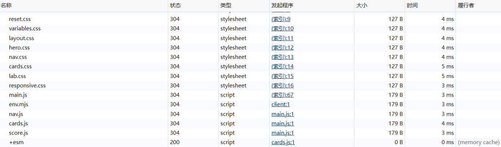
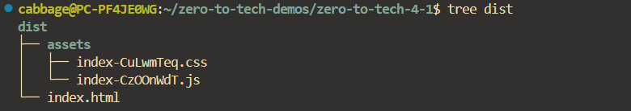

上节的模块化只解决了前端开发中一小部分问题。

``` html title="index.html"
<!doctype html>
<html lang="zh-CN">
  <head>
    ...
    <link rel="stylesheet" href="css/reset.css" />
    <link rel="stylesheet" href="css/variables.css" />
    <link rel="stylesheet" href="css/layout.css" />
    <link rel="stylesheet" href="css/hero.css" />
    <link rel="stylesheet" href="css/nav.css" />
    <link rel="stylesheet" href="css/cards.css" />
    <link rel="stylesheet" href="css/lab.css" />
    <link rel="stylesheet" href="css/responsive.css" />
  </head>
  <body>
    ...
    <script type="module" src="js/main.js"></script>
  </body>
</html>
```

延续上一节模块化改造完的index\.html代码。

目前还有几个可以进一步优化的问题：

一是引入模块化写法以后一定要走HTTP、HTTPS，调试起来不方便。



二是要请求的文件太多，需要排队。虽然拆分代码方便程序员调试维护，但不方便浏览器请求。

三是浏览器会缓存旧文件，比如这里的anime库走的是memory cache。刷新页面可能不会很及时地体现背后代码的变动。一个笨方法是每次改完代码就把文件名也手动修改一下，让浏览器不走缓存，但显然不方便。

构建工具可以帮助解决这三个问题，Vite是现在最流行的一个。

Vite是用TypeScript写跑在Node\.js上的，Node\.js是一套让js能在浏览器外面跑的环境。

npm是Node\.js的包管理器，类似Cargo之于Rust。

``` bash
npm init -y
```

用npm初始化项目，\-y是告诉npm全部走默认，跳过交互式的提问

``` json title="package.json"
{
  "name": "zero-to-tech-4-1",
  "version": "1.0.0",
  "scripts": {
    "test": "echo \"Error: no test specified\" && exit 1"
  }
}
```

初始化完会多一个package\.json，有很多其实没什么用的字段，这里都手动删掉了。

``` bash
npm install -D vite
```

\-D代表装的是开发依赖，不进最终的网站。

``` json title="package.json"
{
  "name": "zero-to-tech-4-1",
  "version": "1.0.0",
  "scripts": {
    "test": "echo \"Error: no test specified\" && exit 1"
  },
  "devDependencies": {
    "vite": "^8.1.0"
  }
}
```

package\.json多了一条依赖。

而且装完以后多了一个node\_modules文件夹，里面有Vite和Vite自身依赖的其他包的源代码，\.bin文件夹里有可执行文件。

还多一个package\-lock\.json，里面有每一个包的具体版本，是为了锁死更深层的依赖。

和Cargo\.toml、Cargo\.lock的设计是一样的。

``` bash
./node_modules/.bin/vite
```

此时执行Vite的可执行文件，Vite就能起一个服务器用于开发预览，而且是热更新不用自己刷新的。解决了文章开头提到的第一个问题。

``` bash
./node_modules/.bin/vite build
```



执行build构建命令，多了一个dist文件夹，里面就是构建产物。这个产物是实际放在服务器的代码。

Vite构建的核心就是保持代码语义，但把代码打包成最适合浏览器使用的形态。可以看到css和js都各自被合成了一个文件，解决了文章开头提到的第二个问题。文件名最后有一串哈希指纹，解决了文章开头提到的第三个问题。

``` bash
./node_modules/.bin/vite preview
```

这个命令会起一个服务器，可以预览dist产物。

``` json title="package.json"
{
  "name": "zero-to-tech-4-1",
  "version": "1.0.0",
  "scripts": {
    "test": "echo \"Error: no test specified\" && exit 1",
    "dev": "vite",             // npm run dev*
    "build": "vite build",     // npm run build*
    "preview": "vite preview"  // npm run preview*
  },
  "devDependencies": {
    "vite": "^8.1.0"
  }
}
```

前面使用Vite的命令都不是很方便，普遍做法是在package\.json自定义命令。

``` js title="cards.js"
import { animate, stagger } from "https://cdn.jsdelivr.net/npm/animejs@4/+esm";
...
```

现在对于anime第三方库的import依然是走cdn服务，为了可靠还是应该让npm把它装成本地依赖。

``` bash
npm install animejs
```

``` js title="cards.js"
import { animate, stagger } from "animejs";
...
```

Vite会将animejs指向node\_modules下的animejs。

``` json title="package.json"
{
  "name": "zero-to-tech-4-1",
  "version": "1.0.0",
  "scripts": {
    "test": "echo \"Error: no test specified\" && exit 1",
    "dev": "vite",
    "build": "vite build",
    "preview": "vite preview"
  },
  "devDependencies": {
    "vite": "^8.1.0"
  },
  "dependencies": {
    "animejs": "^4.5.0"
  }
}
```

顺便package\.json确实能看出来\-D install和普通install的区别。
