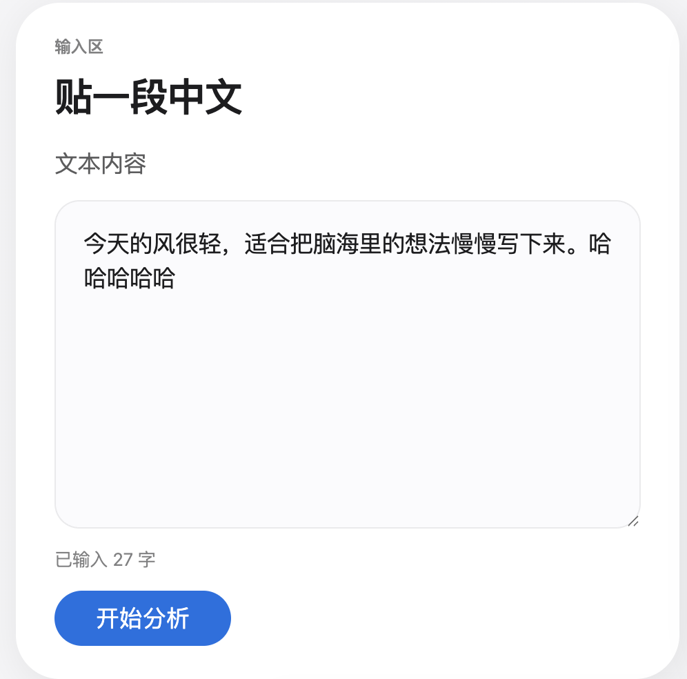

上一节“组件根据运行时输入来渲染”已经能让人感觉到数据驱动页面的思想。

这一节更加深入一下这个概念。

``` js title="HomePage.jsx"
import Nav from "./Nav.jsx";
import PageHeading from "./PageHeading.jsx";
import AnimatedCardGrid from "./AnimatedCardGrid.jsx";

export default function HomePage({ current, onNavigate }) {
  return (
    <AnimatedCardGrid className="dashboard-grid">
      ...
      <article className="hero-stage panel-full">
        <Nav current={current} onNavigate={onNavigate} />
        <PageHeading title="关于我" subtitle="项目，创意，灵感，心得，我的作品" />
      </article>
      ...
  );
}
```

上一节HomePage.jsx把个人主页封装成了一个组件，但里面有些数据仍然处于数据和页面没有分开的状态。

假如想把“关于我”改成别的文字，要在这个复杂的结构里找到再修改。

``` js title="site.js"
// 网站要显示的"内容"，全都集中在这里。
// 想改标题、改文案、加作品？只动这个文件，组件代码一个字都不用碰。
// 这就是"数据与界面分离"：组件只管"怎么显示"，site.js 只管"显示什么"。

// 现在这些值写死在文件里，是因为还没有接入后端。
// 等接入后端，可以改成从网络接口实时取——而组件那边照样一个字都不用动。

export const home = {
  heroTitle: "关于我",
  heroSubtitle: "项目，创意，灵感，心得，我的作品",
  featuredWork: {
    kicker: "作品",
    title: "文字实验室",
    copy: "拼音和情绪，挖掘中文里的细节",
    linkLabel: "打开作品",
  },
  identity: {
    motto: "已识乾坤大，尤怜草木青",
    learning: "零到全栈",
  },
};

export const textLab = {
  heroTitle: "文字实验室",
  heroSubtitle: "拼音和情绪，挖掘中文里的细节",
};
```

通过将网站要显示的所有文字全部集中管理，能实现两者的分离。

即使还没有接入后端也是有好处的。假设网站新增选取语言的功能，可以根据用户当前所选语言来维护site.zh.js、site.en.js、site.jp.js等。比在同一个组件里写大量if、else是方便很多的。

组件目前的输入都是由调用者“喂”的，比如PageHeading的输入由HomePage从上层往下传。

其实组件本身也可以生产数据。



假设要给InputCard新加一个功能，根据输入显示目前已经输入了多少个字。

``` js title="InputCard.jsx"
import { useState } from "react";

// 文字实验室的"输入区"卡片。
// 这一节它多了一个"会变的值"：text——这就是 state。
//   · text 是这个组件自己揣着的值，出生时带着一段默认文字；
//   · 用户每打一个字、删一个字，text 就变；
//   · text 一变，下面那行"已输入 N 字"当场跟着跳——
//     你连一句"找到那个元素再去改它"都不用写，React 自己刷。
export default function InputCard() {
  const [text, setText] = useState("今天的风很轻，适合把脑海里的想法慢慢写下来。");

  return (
    <article className="panel panel-half lab-panel card">
      <div className="panel-heading">
        <p className="section-kicker">输入区</p>
        <h3>贴一段中文</h3>
      </div>
      <form className="lab-form" onSubmit={(e) => e.preventDefault()}>
        <label htmlFor="text-input">文本内容</label>
        <textarea
          id="text-input"
          rows="8"
          placeholder="例如：生活没有标准答案，但每一天都值得认真感受。"
          value={text}
          onChange={(e) => setText(e.target.value)}
        />
        {/* state 现身：text 一变，这行数字自动跟着变 */}
        <p className="lab-count">已输入 {text.length} 字</p>
        <button className="primary-button" type="button">开始分析</button>
      </form>
    </article>
  );
}
```

State就有点像函数的局部变量。不过函数每次被重新调用局部变量会被重置，而State会被React记住，记忆边界是当前页面会话（一刷新就忘记了）。

上一节App.jsx其实已经用到了State来记住目前处于HomePage页面还是TextLab页面，起到路由作用。

而因为State一刷新就会被忘记，所以上一节的代码存在问题，只要一刷新就会回到HomePage页面。而且因为本质上两个页面都挂在index.html，它们的URL都是完全一样的。

解决方法是可以把路由信息存到URL里去。

``` js title="App.jsx" 
import HomePage from "./components/HomePage.jsx";
import TextLabPage from "./components/TextLabPage.jsx";
import { useRoute } from "./router/useRoute.js";

export default function App() {
  // 上一节中，"现在在哪一页"记在内存（useState）里——一刷新就被打回首页。
  // 这一节换成 useRoute：把"在哪一页"读自 / 写入浏览器地址栏。
  const { path, navigate } = useRoute();

  // 看地址栏决定显示哪一页：/text-lab → 文字实验室；其它（含 /）→ 个人主页
  const current = path.startsWith("/text-lab") ? "textlab" : "home";

  // 点导航 → 改地址栏（而不再是改内存里的值）
  const onNavigate = (key) => navigate(key === "textlab" ? "/text-lab" : "/");

  return (
    <div className="app-shell">
      <div className="page-shell">
        <main className="page-content">
          {current === "home"
            ? <HomePage current={current} onNavigate={onNavigate} />
            : <TextLabPage current={current} onNavigate={onNavigate} />}
        </main>
      </div>
    </div>
  );
}
```

``` js title="useRoute.js"
import { useEffect, useState } from "react";

// 一个非常小的"路由"，干三件事：
//   - 读浏览器地址栏的 path，决定显示哪一页（一刷新还在这一页）
//   - 提供一个 navigate(path)，点导航时把"在哪一页"写进地址栏
//   - 用户按浏览器前进 / 后退，界面也跟着变
//
// 关键就在于：上一节把"在哪一页"记在内存里（一刷新就丢）；
// 这一版把它换成"写在网址里"——网址刷新不丢、能整条复制、能前进后退。
//
// 这一版"够用但糙"：自己手写、要兼顾的边角不少。真实项目里大家不手搓，
// 而是用现成的库（叫 react-router）；再往后 Next.js 会用"文件夹=路由"把它整个替掉。
export function useRoute() {
  const [path, setPath] = useState(window.location.pathname);

  useEffect(() => {
    const handler = () => setPath(window.location.pathname);
    window.addEventListener("popstate", handler);
    return () => window.removeEventListener("popstate", handler);
  }, []);

  function navigate(to) {
    if (to === path) return;
    window.history.pushState({}, "", to);
    setPath(to);
  }

  return { path, navigate };
}
```

总结地说，React将前端开发抽象成面向组件以后，界面的显示由“值”决定。

这些值可以是组件内部的State、可以是URL、可以是父亲大组件传进来的输入、可以是site.js里集中定义的模版、可以是后端提供的值。

``` text
├── README.md
├── index.html
├── node_modules
├── package-lock.json
├── package.json
├── src
│   ├── App.jsx
│   ├── components
│   │   ├── AnimatedCardGrid.jsx
│   │   ├── HomePage.jsx
│   │   ├── ...
│   ├── css
│   │   ├── cards.css
│   │   ├── hero.css
│   │   ├── ...
│   ├── data
│   │   └── site.js
│   ├── main.jsx
│   └── router
│       └── useRoute.js
└── vite.config.js
```

这是加入site.js和useRoute.js以后的React项目结构。