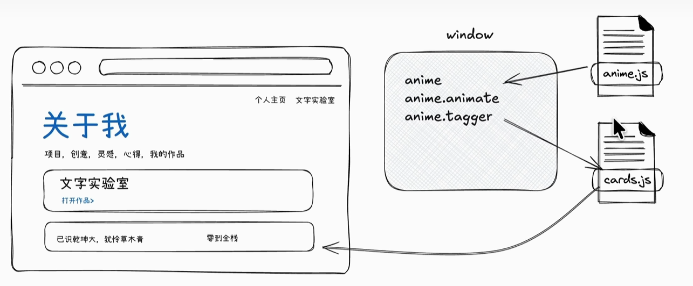
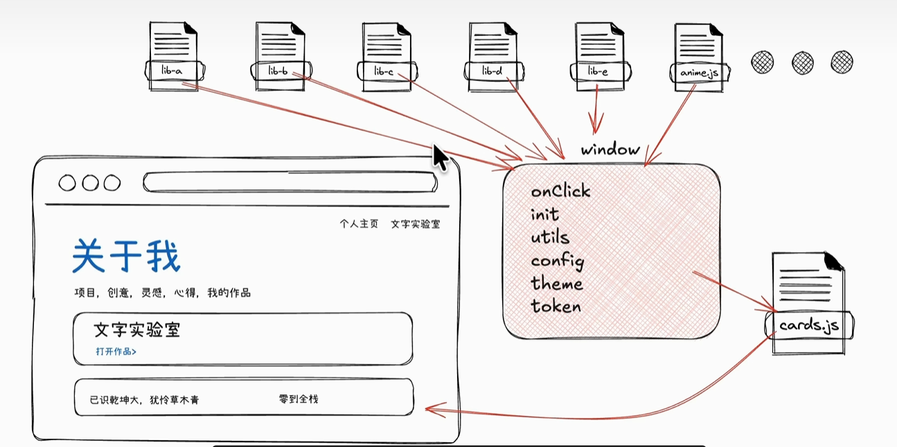
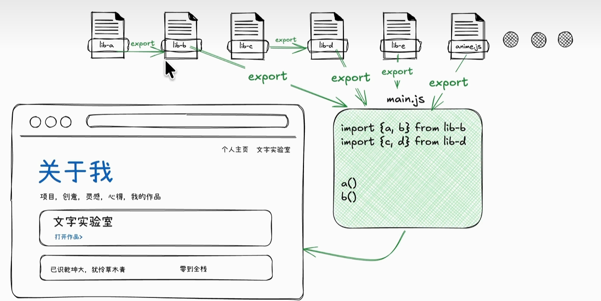

在B站看到了一个不错的课程，[AI时代的全栈开发](https://space.bilibili.com/427191943/lists?sid=8088328&spm_id_from=333.788.0.0)。

作为远古人，我对前端的理解还停留在HTML/CSS/JS三件套（其实这三件套也不熟）。所以现在看AI用现代前端的方法生成代码的时候，经常有两眼一抹黑的感觉。

这个课程讲的还挺清楚的。打算借此入门一下现代前端。

``` html title="index.html"
<!doctype html>
<html lang="zh-CN">
  <head>
    ...
  </head>
  <body>
    ...
    <script src="https://cdn.jsdelivr.net/npm/animejs@4/lib/anime.iife.min.js"></script>
    <script src="js/cards.js"></script>
  </body>
</html>
```

``` js title="cards.js"
(function () {
  anime.animate(".card", {
    opacity: [0, 1],
    translateY: [24, 0],
    delay: anime.stagger(120),
    duration: 700,
    ease: "outBack",
  });
})();
```

假设有这样一个index\.html（最简单的原生html/css/js）。引入了两个script，一个是第三方anime库，一个是本地的cards\.js负责给当前页面所有card加上闪烁效果。



cards\.js里用到了anime\.stagger这个函数，依赖第三方anime库。也就是说一定要先导入anime库，再导入cards\.js，这里代码层面的先后导入顺序需要程序员靠人脑记住。



window是浏览器环境下的全局顶层对象，一个独立的html对应一个window。anime\.stagger是第三方库往当前页面的window挂的名字。容易想到引入的第三方库多的时候，不同的第三方库容易撞名字，导致全局污染。



现代前端在ES6标准后引入import/export标准，用模块化的方法解决这两个问题。

每个JS文件写的东西默认只有自己看得见，想让别人看得见需要显式export，想用别人的需要显式import。

``` js title="cards.js"
import { animate, stagger } from "https://cdn.jsdelivr.net/npm/animejs@4/+esm";

export function initCardsAnim() {
  animate(".card", {
    opacity: [0, 1],
    translateY: [24, 0],
    delay: stagger(120),
    duration: 700,
    ease: "outBack",
  });
}
```

``` js title="main.js"
import { initCardsAnim } from "./cards.js";

initCardsAnim();
```

``` html title="index.html"
<!doctype html>
<html lang="zh-CN">
  <head>
    ...
  </head>
  <body>
    ...
    <script type="module" src="js/main.js"></script>
  </body>
</html>
```

将cards\.js改造成模块化版本，新建main\.js作为该页面所有js的总开关。可以发现导入顺序问题、全局名称污染问题就解决了。

不过引入模块化写法以后，本地打开文件会报跨域错误，浏览器出于安全考虑，规定模块化文件一定要走HTTP或者HTTPS服务。